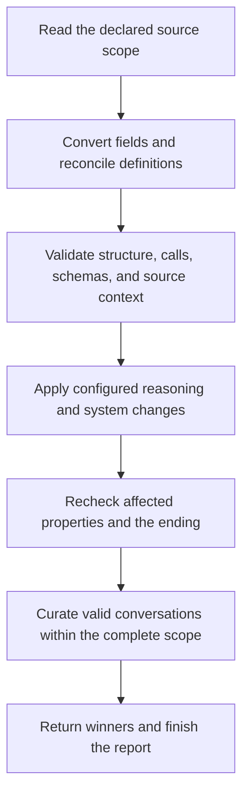

# How conversations are loaded

[Documentation](README.md) · Next: [Using loaders](loading.md)

A loader interprets a released dataset, checks its conversations, and returns
`ConversationSample` objects. It preserves the recorded roles, context, calls,
and observations through documented conversions. It never executes the calls
or invents a missing continuation.

## One conversation, several assistant decisions

The [weather example](examples/weather_loader.py) contains:

```text
user       What is the weather in Paris?
assistant  get_weather({"city": "Paris"})
tool       Sunny.
assistant  <think>Read the weather result.</think>Sunny.
```

This is one conversation, one user turn, one tool call, and two assistant
decisions. A training pipeline could make a target for the call and another
for the answer. The loader returns the conversation needed for both.

## The output object

[`ConversationSample`](../src/fcanalysis/format.py) has six fields:

| Field | Meaning |
| --- | --- |
| `messages` | Ordered model-visible conversation |
| `tools` | Complete initially available tool definitions |
| `dataset` | Source label |
| `sample_id` | Existing source ID or the adapter's documented source coordinate |
| `annotations` | Facts for downstream selection or analysis |
| `raw` | Original selected source row |

Only `messages` and `tools` belong in model input. `annotations` and `raw`
default to separate empty dictionaries. Source IDs need not be unique.
Constructing this dataclass performs no validation.

With default reasoning removal, the weather example produces this normalized
data. Its full source row is also stored in `raw`, omitted here for readability:

```python
from fcanalysis import ConversationSample

sample = ConversationSample(
    dataset="example/weather",
    sample_id="weather-1",
    tools=[{
        "type": "function",
        "function": {
            "name": "get_weather",
            "description": "Return the weather for a city.",
            "parameters": {
                "type": "object",
                "properties": {"city": {"type": "string"}},
                "required": ["city"],
                "additionalProperties": False,
            },
        },
    }],
    messages=[
        {"role": "user", "content": "What is the weather in Paris?"},
        {
            "role": "assistant",
            "tool_calls": [{
                "type": "function",
                "function": {
                    "name": "get_weather",
                    "arguments": '{"city":"Paris"}',
                },
            }],
        },
        {"role": "tool", "content": "Sunny."},
        {"role": "assistant", "content": "Sunny."},
    ],
)
```

Canonical roles are `system`, `user`, `assistant`, and `tool`; `content` may
be absent, null, or text. Assistants may also have text/null `reasoning_content`
and a `tool_calls` list. Native calls contain `type: "function"` and
`function: {name, arguments}`. Names are nonempty, case-sensitive strings;
arguments are JSON **object strings**. Structured source arguments are
serialized; existing argument strings and opaque result text keep their spelling.

There must be at least one user message. Repeated roles alone are not an error.
Definitions retain all supplied fields, including unused tools and fields
outside `function`. A tool discovered later stays at its discovery point.
Other source fields need an explicit adapter interpretation.

Normalized mutable values are independent of `raw`. Field absence, null,
scalar types, array order, and text remain distinct unless a documented
conversion changes them. Curation preserves the winning sample's values,
although disk storage can return a new Python object.

## Follow a row through loading



Here, a *scope* is the complete set of candidates allowed to affect one another
during selection, such as one dataset subset and split at a fixed revision.
Arbitrary file chunks are not automatically separate scopes.

A required check failure excludes the candidate. For weather, the stages
confirm that `get_weather` exists, `city` satisfies its schema, and the result
belongs to the call. Reasoning removal leaves `Sunny.`; final checks validate
that transformed conversation.

Source checks precede transforms: replacing a system message cannot rescue an
invalid source. A transform can also invalidate a row—for example, stripping
the only content from an earlier assistant. [Prefix loaders](loading.md#assistant-target-prefixes)
restore omitted fields before candidate validation and select valid maximal
prefixes before general curation. Experimental
[Turnstile](loading.md#available-loaders) does not implement this full pipeline.

## Calls, results, and endings

A native call batch is one assistant's `tool_calls` list. Exactly one result
per call must follow in an uninterrupted block of tool messages. In the weather
source, `call-1` proves the match. The loader then removes temporary
`id`/`tool_call_id` fields; the originals remain in `raw`.

For several calls, IDs or other source-supported evidence can prove a different
result order. The loader aligns whole results to the unchanged call order.
Equal counts alone cannot establish the matches. See
[matching calls and results](adding-loaders.md#matching-calls-and-results) for
the evidence rules. A provider API may require IDs again; its renderer must
translate the canonical format.

The ordinary ending is an assistant answer without pending calls. It needs
non-whitespace visible content outside recognized native reasoning; a tool
result, reasoning-only answer, recognized native control tags alone, or an unclosed native-only
tail cannot close it. Code literals remain visible. Other ambiguous reasoning
boundaries follow the [adapter's reasoning policy](loading.md#reasoning-and-system-settings).
Earlier assistants need non-whitespace content, reasoning, or calls. Empty
decisions are excluded rather than deleted from the history.

## Validation, curation, and SFT

Validation checks whether the recorded interaction meets the supported rules.
Curation selects among valid conversations using temporary comparison views;
it returns an unchanged winner. Default Level 2 can group different assistant
answers and choose the shortest total assistant content. This does not rank
answer quality. Read the [curation settings](loading.md#curation-settings)
before choosing your output population.

Supervised fine-tuning (SFT) chooses how to render these conversations, which
assistant decisions receive loss, which historical reasoning to expose, and
how to truncate, pack, or weight examples. Those choices belong to training
code. A retained failure or retry can be useful context without being a target.

Acceptance does not establish general answer correctness, successful execution,
or compliance with arbitrary natural-language policies. An observed error can
be a valid result. Completion refers to the supported released ending, not an
unavailable original dialogue.

Some sources encode actions as assistant text and observations as user messages.
[Terminal conversations](loading.md#terminal-conversations) use that form;
`tools=[]` does not make them ordinary question-answer data.
